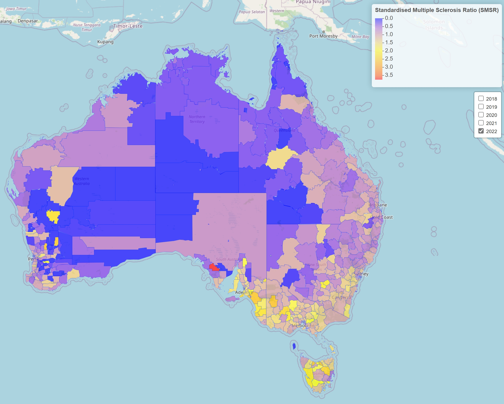
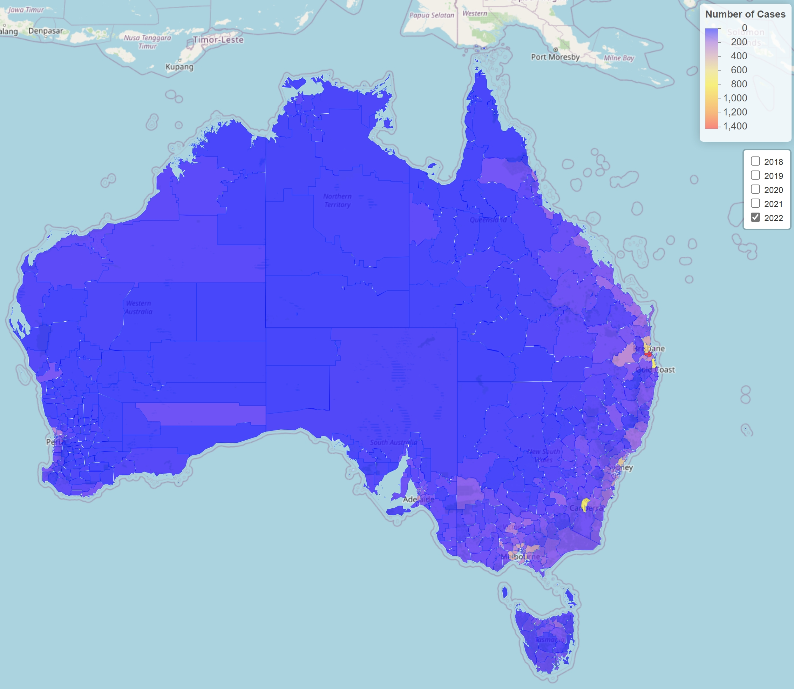

# Multiple Sclerosis Choropleth Maps

To access the interactive choropleth maps, please click on the link below:
https://albert-l-phan.github.io/Multiple_Sclerosis_Choropleth_Maps/

From there, click on the pictures of the choropleth maps to access an interactive version. 
Once the interactive map is displayed, click on any LGA to find out the Standardised Multiple Sclerosis Ratio, Number of Cases and Population in that area.

